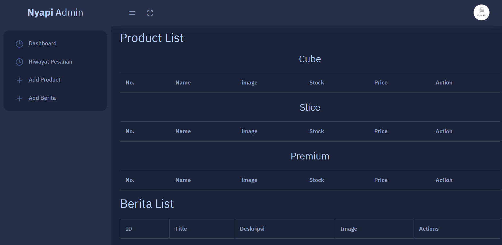
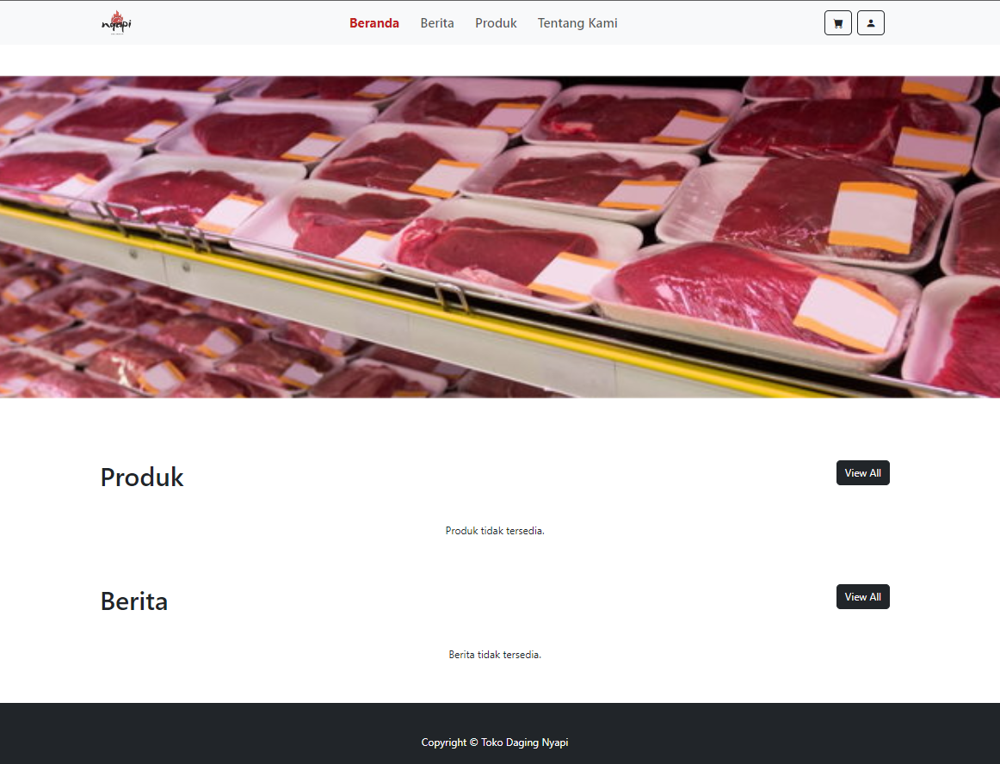

<h1 align="center" style="font-size: 30px">Website Toko Daging Nyapi - Laravel</h1>

## Documentation




## About

This project is the creation of a Nyapi meat shop website. This project is a web application developed using Laravel. This website has 2 different pages, namely the User page and the Administrator page. Users can access information about available products, as well as the latest news. Administrators can manage every information content presented on the website. There is information about transaction data made by users on the admin dashboard page.

## Server Requirements

- PHP version 7.2 or newer is recommended.
- MySQL
- Laravel
- Composer

## Available Features

-  User Page
    -  Beranda
         -  Tampilan beberapa Product
         -  Tampilan beberapa Berita
    -  About
        -  Tentang Nyapi Store Page
    -  Berita Page
        -  Semua Berita yang tersedia
        -  Detail Berita Page
    -  Product Page
        -  Semua Product yang tersedia
        -  Detail Product Page
    -  Login Page
        -  Halaman login user
    -  Cart
        -  Tampilan product setelah dimasukan cart
        -  Checkout
-  Add Admin Panel
    -  Login Page
    -  Dashboard Page
    -  Manage All Transaction 
    -  Manage Berita Page
    -  Manage Product Page
-  Add Databases
-  Add Routes
-  Add Models
-  Add Controllers
-  Add Views
-  Add Authentication & Multi Roles
-  Add CRUD Function
-  Add Responsive Design


## Getting Started

Follow the instruction below to install the project locally.

## Installation

Follow the steps below for installation of this project.

1. *Clone Repositori*

   bash
   git clone https://github.com/tokonyapi/toko-daging-nyapi.git
   cd toko-daging-nyapi
2. **Instal Dependensi PHP**

    Jalankan perintah berikut untuk menginstal semua dependensi PHP menggunakan Composer:
    
    bash
    composer install
3. *Salin File .env*

    Salin file .env.example menjadi .env:
   
    bash
    cp .env.example .env
    
5. **Generate Application Key**

    Jalankan perintah berikut untuk menghasilkan application key:
    
    bash
    php artisan key:generate

6. *Migrasi Database*

    Jalankan migrasi untuk membuat tabel di database:
    
    bash
    php artisan migrate:fresh

7. **Migrasi Seeder**

    Jalankan migrasi untuk mengisi tabel di database:
   
   bash
    php artisan db:seed --class=AdminSeeder

8. *Running Applications*

    Jalankan server pengembangan lokal:

   ```bash
   php artisan serve

9. Login Administrator:
    - Email: admin@gmail.com
    - Password: admin123

Note: 
- Replace [DB_DATABASE] with actual database name where you import the database.


## Contact

If you have any questions, feel free to reach out to at tokonyapi@gmail.com.

<!-- MARKDOWN LINKS & IMAGES -->
<!-- https://www.markdownguide.org/basic-syntax/#reference-style-links -->
[Admin]: public/assets/Admin.png
[Home]: public/assets/User.png
